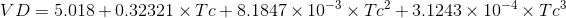

# Evaporative Water Loss

R code (ewlR function) to compute evaporative water loss and skin resistance of frogs or salamanders measured in air flow chambers (see REF for experimental protocol). I want to thank Keith A. Christian for help with calculations. 

These parameters are required:

**1. mass:** mass of frog/salamander in grams

**2. mass_m:** mass of the animal's agar model in grams

**3. V<sub>i</sub>:** air flow in the empty chamber

**4. V<sub>e</sub>:** air flow in the animal chamber

**5. V<sub>m</sub>:** air flow in the agar model chamber

**6. RH<sub>i</sub>:** relative humidity in empty chamber (expressed as decimal fraction; e.g. 0.50 for a RH of 50%)

**7. RH<sub>e</sub>:** relative humidity in animal chamber (expressed as decimal fraction)

**8. RH<sub>m</sub>:** relative humidity in agar model chamber (expressed as decimal fraction)

**9. T<sub>i</sub>:** temperature in empty chamber

**10. T<sub>e</sub>:** temperature in animal chamber

**11. T<sub>m</sub>:** temperature in agar model chamber

**12. T<sub>skin</sub>:** animal's skin temperature

**13. T<sub>skin_m</sub>:** agar model's 'skin' (surface) temperature

**14. morpho:** either 'frog' or 'salamander' (to compute the surface area; SA)

## Using the function
Once you have all the required parameters, just load the function and it will return a list with **Evaporative Water Loss** (EWL), **Mass Specific Evaporative Water Loss** (Mass_EWL), **Surface Area Specific Evaporative Water Loss** (SurfArea_EWL), and **skin resistance to water loss** (Rc). See next section for details of the calculations. 

```{r}
source('./ewlR.R')

ewlR(mass = 56, mass_m = 54, Vi = 1.04, Ve = 1.03, Vm = 1.00, 
     RHi = 0.036, RHe = 0.35, RHm = 0.36,
     Ti = 22.7, Te = 23.1, Tm = 23.2, Tskin = 19.3, Tskin_m = 19.5, morpho='frog')

$EWL
[1] 6.706037

$Mass_EWL
[1] 7.18504

$SurfArea_EWL
[1] 6.398645

$Rc
[1] 0.159015

```

## EWL calculations explained

* __Estimating saturation vapor density__

I have implemented the following equation to calculate saturation vapor density at different temperatures:



*VD* stands for saturation vapor density and *Tc* for temperature in degrees Celsius. The equation was taken from (REF).


* __Estimating surface area__

for a frog $9.9 \times (m<sup>0.56</sup>)$

for a salamander 8.42 * (m<sup>0.694</sup>) 