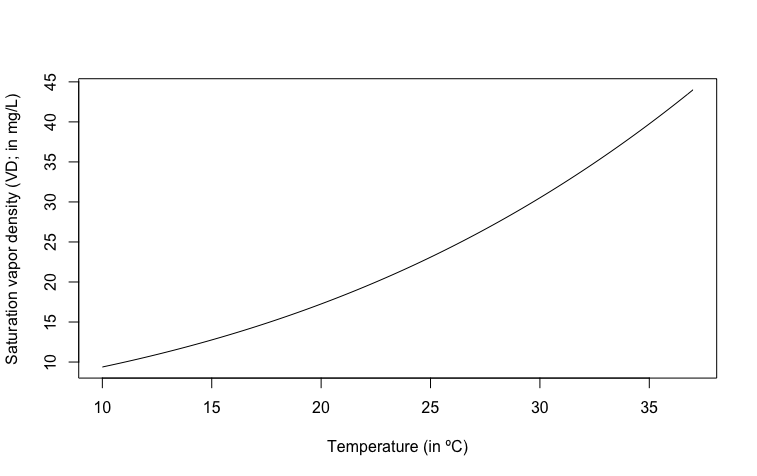

# Evaporative Water Loss

R code (ewlR function) to compute evaporative water loss and skin resistance of frogs or salamanders measured in air flow chambers (see REF for experimental protocol). I want to thank Keith A. Christian for help with calculations (see [ EWL calculations explained ](#ewl-calculations-explained)). 

These parameters are required:

`mass`: mass of frog/salamander in grams

`mass_m`: mass of the animal's agar model in grams

`Vi`: air flow in the empty chamber

`Ve`: air flow in the animal chamber

`Vm`: air flow in the agar model chamber

`RHi`: relative humidity in empty chamber (expressed as decimal fraction; e.g. 0.50 for a RH of 50%)

`RHe`: relative humidity in animal chamber (expressed as decimal fraction)

`RHm`: relative humidity in agar model chamber (expressed as decimal fraction)

`Ti`: temperature in empty chamber

`Te`: temperature in animal chamber

`Tm`: temperature in agar model chamber

`Tskin`: animal's skin temperature

`Tskin_m`: agar model's 'skin' (surface) temperature

`morpho`: either 'frog' or 'salamander' (to compute the surface area; SA)

## Using the function
Once you have all the required parameters, just load the function and it will return a list with **Evaporative Water Loss** (`EWL`), **Mass Specific Evaporative Water Loss** (`Mass_EWL`), **Surface Area Specific Evaporative Water Loss** (`SurfArea_EWL`), and **skin resistance to water loss** (`Rc`). See next section for details of the calculations. 

```{r}
source('./ewlR.R')

ewlR(mass = 56, mass_m = 54, Vi = 1.04, Ve = 1.03, Vm = 1.00, 
     RHi = 0.036, RHe = 0.35, RHm = 0.36,
     Ti = 22.7, Te = 23.1, Tm = 23.2, Tskin = 19.3, Tskin_m = 19.5, morpho='frog')

$EWL
[1] 6.706037

$Mass_EWL
[1] 7.18504

$SurfArea_EWL
[1] 6.398645

$Rc
[1] 0.159015

```

## EWL calculations explained

We will determine **evaporative water loss** (`EWL`) following the next equation:

<p align="center">
<i>EWL</i> = <i>V<sub>e</sub></i> &times; &Omega;<sub>e</sub> - <i>V<sub>i</sub></i> &times; &Omega;<sub>i</sub> ; <i>This is in mg min<sup>-1</sup></i>
</p>

*V<sub>e</sub>* is the flow in the chamber with the animal. *V<sub>i</sub>* is the flow in the empty chamber (or in the chamber *without* the animal). &Omega;<sub>e</sub> is the water vapor density in the chamber with the animal. &Omega;<sub>i</sub> is the water vapor density in the empty chamber. 

Air flow values (*V*) are measured with the flowmeter (either digital or analogic, depending on your experimental setup). 

Water vapor density (&Omega;) values are determined this way:

<p align="center">
&Omega;<sub>e</sub> = <i>Saturation vapor density at T<sub>e</sub></i> &times; <i>RH<sub>e</sub></i>
</p>

<p align="center">
&Omega;<sub>i</sub> = <i>Saturation vapor density at T<sub>i</sub></i> &times; <i>RH<sub>i</sub></i>
</p>

*RH* is the relative humidity either in the animal (`RHe`) or empty (`RHi`) chamber in decimal fraction. Saturation vapor density can be obtained looking at the Smithsonian Table 108 and finding the value that corresponds to the temperature measured either in the animal (`Te`) or empty (`Ti`) chamber. However, I have implemented an equation that does that automaticly, based on those temperatures (see [ Estimating saturation vapor density ](#estimating-saturation-vapor-density)).


Evaporative water loss is also expressed as **Mass specific EWL** (`Mass_EWL`). To get this value, we need to divide total EWL by the mass of the animal and multiply by 60 (to convert minutes to hours):

<p align="center">
<i>Mass_EWL</i> = <i>EWL</i> &times; <span class="fraction"> 1 / <i>m</i> </span> &times; <span class="fraction"> 60 min / 1 h </span> ; <i>This is in mg g<sup>-1</sup> h<sup>-1</sup></i>
</p>

Evaporative water loss is also usually reported as **Surface area specific EWL** (`SurfArea_EWL`), which is obtained by dividing total EWL by the surface area (*SA*; see [ Estimating surface area ](#estimating-surface-area) for surface area calculations) of an individual in water conserving posture (2/3 *SA*). This value is then multiplied by 60 (to convert minutes to hours):

<p align="center">
<i>SurfArea_EWL</i> = <i>EWL</i> &times; <span class="fraction"> 1 / (2/3 &times; <i>SA</i>) </span> &times; <span class="fraction"> 60 min / 1 h </span> ; <i>This is in mg cm<sup>-2</sup> h<sup>-1</sup></i>
</p>


* ### Skin resistance to water loss

To compute cutaneous resistance to  water loss (`Rc`) we need to compare EWL of living animals and agar models with no skin resistance. 

The total resistance to water loss (&Gamma;<sub>T</sub>) consists of two parts: the boundary layer resistance (&Gamma;<sub>b</sub>; a function of the size and shape of the animal) and the cutaneous resistance (&Gamma;<sub>c</sub>), which is caused by characteristics of the skin or secretions on the skin. Hence:

<p align="center">
&Gamma;<sub>T</sub> = &Gamma;<sub>b</sub> + &Gamma;<sub>c</sub>
</p>

To calculate total resistance (&Gamma;<sub>T</sub>) we use the next expression:

<p align="center">
&Gamma;<sub>T</sub> = <span class="fraction"> <i>VDD</i> / <i>SurfArea_EWL</i> </span>
</p>

*VDD* is the vapour density difference between the skin of the animal and the air in the chamber. It is calculated using the following equation:

<p align="center">
<i> VDD = VD<sub>s</sub> - &Omega;<sub>e</sub> </i>
</p>

*VD<sub>s</sub>* is the vapor density at the animals skin and can be obtained by measuring the skin temperature (`Tskin`). This temperature value is then converted to saturation vapor density automaticly using an empirical equation (see [ Estimating saturation vapor density ](#estimating-saturation-vapor-density)). &Omega;<sub>e</sub> (water vapor density in the chamber with the animal) was calculated to compute EWL (see above). 

As we already mentioned, agar replicas of animals have no cutaneous resistance to water loss and thus, &Gamma;<sub>T</sub> = &Gamma;<sub>b</sub>. To calculate boundary layer resistance (&Gamma;<sub>b</sub>), we need to re-do all calculations for the agar model and calculate &Gamma;<sub>T</sub> for the model as explained above (according to the models' 'skin' temperature; `Tskin_m`). 

To calculate cutaneous resistance to water loss (`Rc` &Gamma;<sub>b</sub>), we only have to subtract the models' &Gamma;<sub>T</sub> value (= &Gamma;<sub>b</sub>) from animals &Gamma;<sub>T</sub> (= &Gamma;<sub>T</sub>):

<p align="center">
<i> &Gamma;<sub>c</sub> = &Gamma;<sub>T, animal</sub> - &Gamma;<sub>T, model</sub> </i>
</p>


* ### Estimating saturation vapor density

I have implemented the following equation to calculate saturation vapor density at different temperatures:

<p align="center">
<i>VD</i> = 5.018 + 0.32321 &times; <i>T<sub>c</sub></i> + 8.1847 &times; 10<sup>-3</sup> &times; <i>T<sub>c</sub></i><sup>2</sup> + 3.1243 &times; 10<sup>-4</sup> &times; <i>T<sub>c</sub></i><sup>3</sup>
</p>

*VD* stands for saturation vapor density and *T<sub>c</sub>* for temperature in degrees Celsius. The equation was taken from (REF).




* ### Estimating surface area

The `morpho` parameter determines which equation is used to calculate the surface area of the individual based on its mass. 

To estimate the surface area of a frog/toad, I have implemented this equation:

<p align="center">
9.9 &times; (<i>m</i><sup>0.56</sup>) ; <i>m stands for mass (in mg)</i>
</p>

To estimate the surface area of a salamander, I have implemented this equation taken from Riddell *et al.* 2017:

<p align="center">
8.42 &times; (<i>m</i><sup>0.694</sup>) ; <i>m stands for mass (in mg)</i>
</p>

**NOTE: if you have the equation for your particular species, you can just change the equation (or parameters) within the ewlR function.**

## References

Riddell *et al.* 2017. Physical calculations of resistance to water loss improve predictions of species range models. *Ecological Monographs* **87(1): 21–33**

